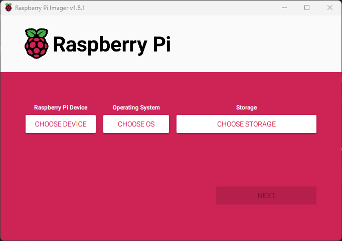
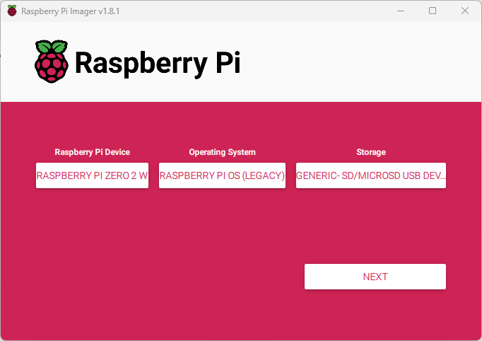
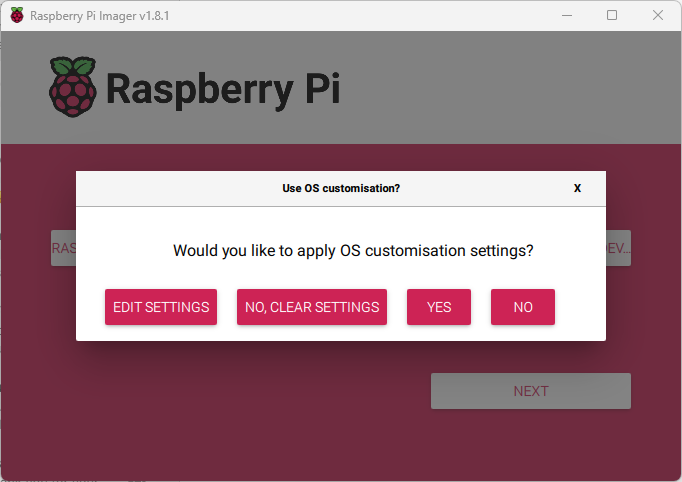
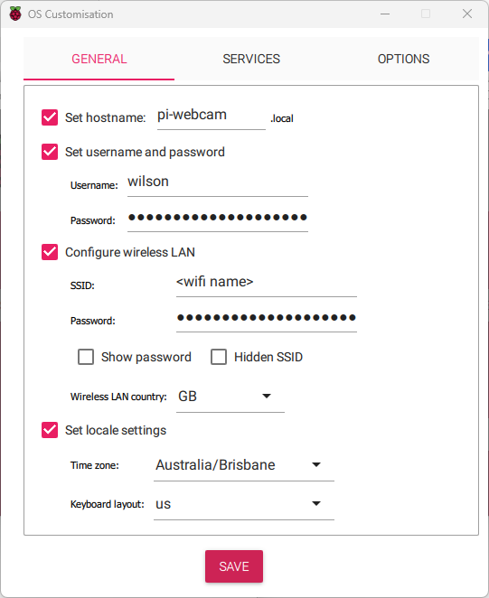

# Raspberry Pi as Webcam

This is intended to help you turn your [Raspberry Pi Zero 2 W](https://www.raspberrypi.com/products/raspberry-pi-zero-2-w/) into a webcam via USB, aka a USB gadget. Once setup, you should be able to plug your pi into the computer (or any other devices) through a USB cable.

I made this after following a tutorial but getting the error:
> "USB device not recognized. The Last USB device you connected to this computer malfunctioned and Windows does not recognize it. Windows Explorer"

## Table of contents
- [Ingredients](#ingredients)
- [TL; DR](#tl;dr)
- [Step by step](#step_by_step)
- [References](#references)

## Ingredients <a name="ingredients"></a>
Feel free to use these links and give me 10% :)
- 1 x <a target="_blank" href="https://www.amazon.com.au/Raspberry-Pi-Zero-Wireless-Bluetooth/dp/B0BQJRKVXB/ref=sr_1_5?keywords=raspberry+pi+zero+2&amp;qid=1702012828&amp;sr=8-5&_encoding=UTF8&tag=roboticsplayg-22&linkCode=ur2&linkId=00ce909a0ab7f22015c118984412847e&camp=247&creative=1211">Raspberry Pi Zero 2 W</a> (Note*)
- 1 x <a target="_blank" href="https://www.amazon.com.au/Arducam-Raspberry-Autofocus-Acrylic-15-22pin/dp/B0BX6N6V98/ref=sr_1_7?crid=3GX0SWFC7Q1LE&amp;keywords=raspberry+pi+camera+3&amp;qid=1702013008&amp;sprefix=raspberry+pi+camera+3%252Caps%252C256&amp;sr=8-7&_encoding=UTF8&tag=roboticsplayg-22&linkCode=ur2&linkId=99f7bc397c1dbd9de13b7dfad0cb3d65&camp=247&creative=1211">Raspberry Pi Module 3</a> (Note**)
- 1 x <a target="_blank" href="https://www.amazon.com.au/SanDisk-Ultra-microSDHC-Memory-Adapter/dp/B08GY9NYRM/ref=sr_1_6?crid=1WIW021ZLJIT7&amp;keywords=SD+card+sandisk+ultra+32+GB&amp;qid=1702013627&amp;sprefix=sd+card+sandisk+ultra+32+gb%252Caps%252C263&amp;sr=8-6&_encoding=UTF8&tag=roboticsplayg-22&linkCode=ur2&linkId=300d921d245d7cbdc401377e59a3ac3d&camp=247&creative=1211">SD Card (32GB min)</a> You can also get one with Raspberry Pi OS pre-loaded, but it might affect if it works or not <a target="_blank" href="https://www.amazon.com.au/Raspberry-Preloaded-NOOBS-Compatible-Models/dp/B07F22Q6PN/ref=sr_1_1?crid=2KTP79EFO0RUA&amp;keywords=SD+card+for+pi+zero&amp;qid=1702013685&amp;sprefix=sd+card+for+pi+zerp%252Caps%252C286&amp;sr=8-1&_encoding=UTF8&tag=roboticsplayg-22&linkCode=ur2&linkId=f07a63bf6d8f37afdc6630695af120ff&camp=247&creative=1211">SD Card, Pi OS preloaded</a>
- (recommended) 1 x [Pi Power Supply](https://raspberry.piaustralia.com.au/products/raspberry-pi-power-supply-5v-2-5-amp)


\* Make sure to get a USB cable if you don't use the link. Double check that it's a data cable.

** Make sure to get the cable if you don't buy it as a pack. 

## TL; DR <a name="tl;dr"></a>
Go follow the following tutorial until you get up to the `/etc/rc.local` stage, we'll use `systemd` instead.

Tutorial: https://www.raspberrypi.com/tutorials/plug-and-play-raspberry-pi-usb-webcam/

Don't touch the `/etc/rc.local` file. Instead go:
```bash
sudo nano /lib/systemd/system/pi_webcam.service
```
```bash
[Unit]
Description=Boot up Pi camera
After=multi-user.target

[Service]
ExecStart=/home/<username>/.rpi-uvc-gadget.sh &

[Install]
WantedBy=multi-user.target
```

replace `<username>` with your username.

```bash
sudo systemctl daemon-reload
sudo systemctl pi_webcam.service
sudo reboot
```


## Step by Step <a name="step_by_step"></a>
### Set up the Pi OS 
*We will need to make sure we're using Raspberry Pi OS Bullseye.*

_This is OPTIONAL, Skip to the next section if you got an SD card without the Pi OS._

0. insert the SD card into your computer.
1. Download the Raspberry Pi OS Imager from here: https://www.raspberrypi.com/software/operating-systems/
2. When you boot up the imager, you should see the following:


3. Select the options for a Pi Zero 2 W, Raspberry Pi OS (Legacy), SD card location:


4. Select `Next` and you should be prompted customisation settings, we do want to put some in because then we don't need to connect the pi to keyboard/mouse/monitor. Select `EDIT SETTINGS`.


5. 
    `Set hostname:`, you can pick whatever you want, keep in mind this is how we're going to SSH into the pi so pick something sensible. I used `pi-webcam`. 

    `Set username and password:` will set the user/password for the pi, when you ssh into the pi, you'll need to enter the password you have inputted here.

    `Configure wireless LAN: ` is where you want to set the wifi details that the pi will connect to. Put in your wifi login here.

    

6. Select `Save` and then hit `Next`. The imager will let you know when it's all ready to go!

7. When it's ready, you can remove the SD card from your computer and put it into the Pi Zero! :)

Go and check this [tutorial](https://www.raspberrypi.com/documentation/computers/getting-started.html#installing-the-operating-system) out if you're having issues. Note that you don't need to plugin the keyboard/mouse/monitor.

### SSH into the Pi!

This was done basing off this tutorial: 
https://www.raspberrypi.com/tutorials/plug-and-play-raspberry-pi-usb-webcam/

Go follow the following tutorial until you get up to the `/etc/rc.local` stage, we'll use `systemd` instead.


Go to this tutorial and then come back when you get up to the part where it tells you to do this:
```bash
$ sudo nano /etc/rc.local
```
Tutorial: https://www.raspberrypi.com/tutorials/plug-and-play-raspberry-pi-usb-webcam/

Don't make changes to the `/etc/rc.local` file.


## References <a name="references"></a>
Setting up the Pi OS: https://www.raspberrypi.com/documentation/computers/getting-started.html#installing-the-operating-system

Setting up camera: https://www.raspberrypi.com/tutorials/plug-and-play-raspberry-pi-usb-webcam/

Using systemd: https://www.digitalocean.com/community/tutorials/understanding-systemd-units-and-unit-files